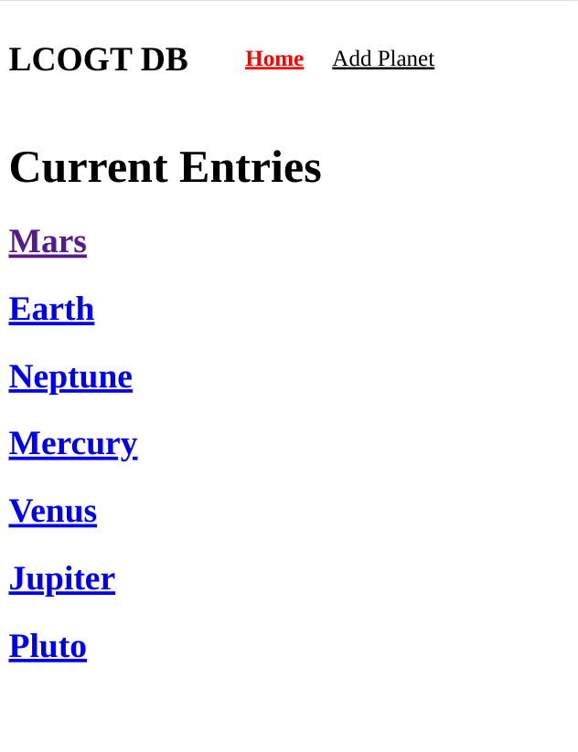
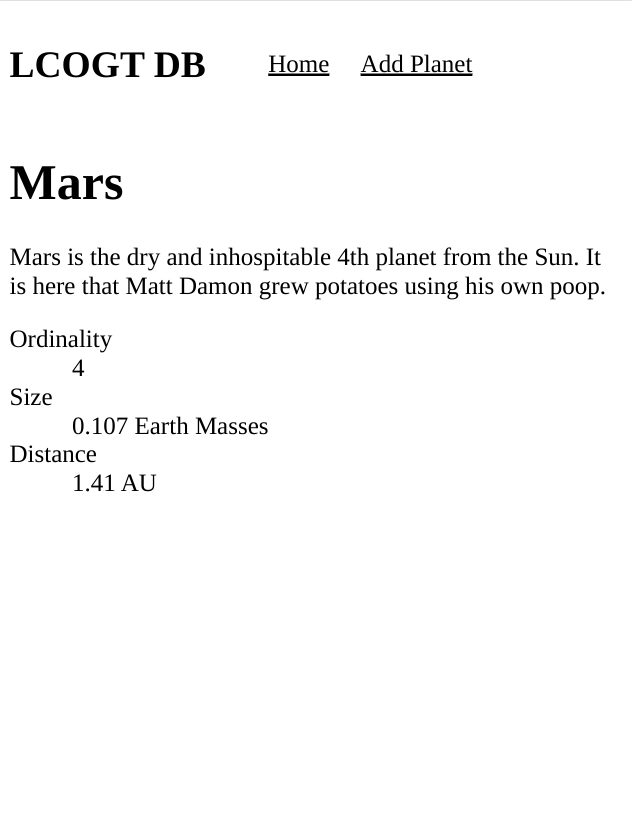
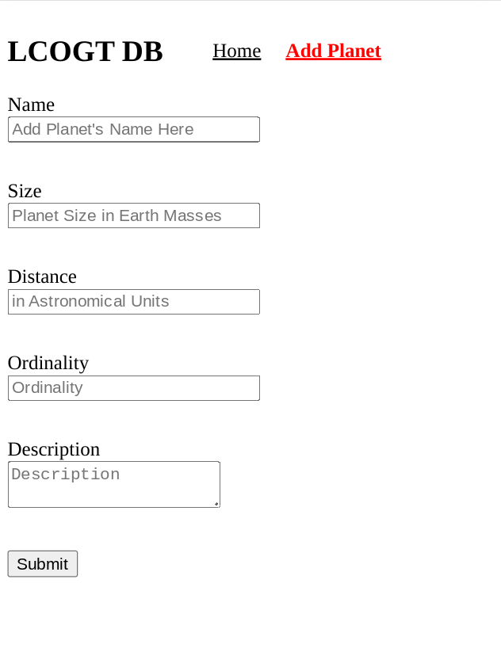
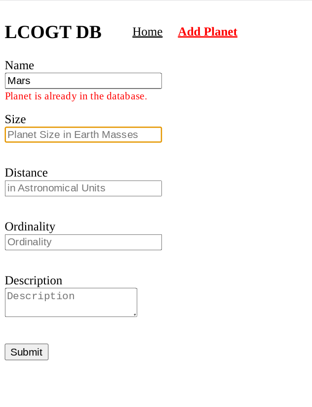
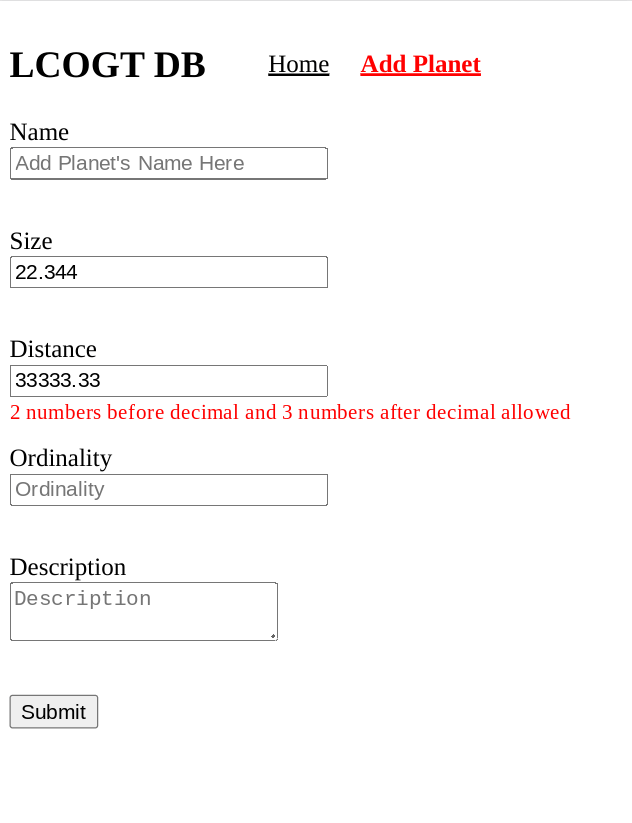
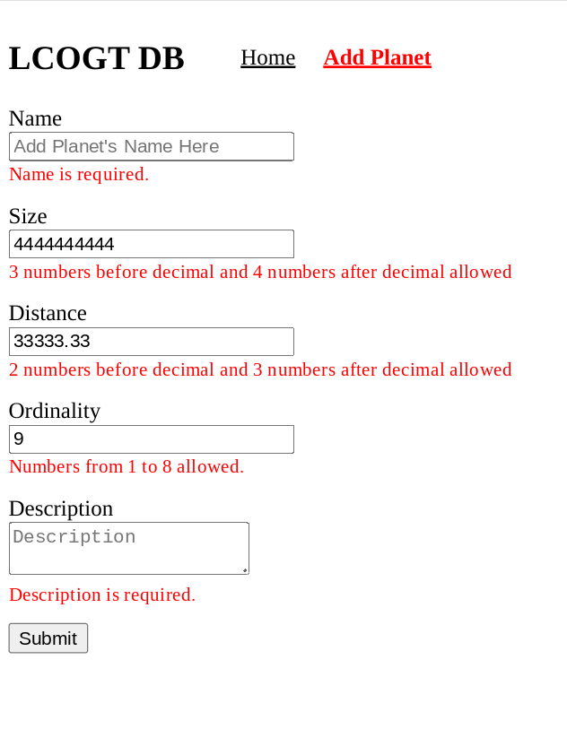

# LCOGT Angular Frontend

This is a conversion of [my previous solution](https://github.com/jdegand/LCOGT-takehomeinterview) to this [repo](https://github.com/LCOGT/takehomeinterview).

## Screenshots

***

***

***

***

***

***

## Goal
Create a web application where a user can view and add planets to a database.

### Estimated time for completion:
2-4 Hours

### Instructions
Use whatever programming language/framework that is most comfortable to you. The deliverable
product should be the sourcecode to a runnable web application with all the requirements met.
The database should be blank: you do not need to provide any data with the deliverable.

Place any special setup instructions in a file called SETUP.

Using github, you should fork this repository ([Github: how to fork a repository](https://help.github.com/articles/fork-a-repo/)) and add the code you have written to it. When you are done, open a pull request. It will then be reviewed.

## Requirements

#### The homepage

The homepage should contain a list or table of the planets that have been added to the database
along with their name, size, distance and ordinality.

For example:

    Ordinality  Name     Size    Distance
    1           Mercury  0.05    0.34
    2           Venus    0.08    0.72

The name of the object should link to that object's detail page.

#### The input form

A simple form for adding a planet to the database. The form should have 5 inputs:
Name, Size (in Earth Masses), Distance (from the sun, In Astronomical Units), Ordinality (Mercury: 1, Neptune: 8)
and Description.

For example:

          ____          ____              ____                ____
    Name |____|   Size |____|   Distance |____|   Ordinality |____|
                  __________________________________
    Description: |                                  |
                 |                                  |
                 |__________________________________|
     ______
    |SUBMIT|

Name and ordinality should be unique. Size, Ordinality and Distance should be restricted to numerical input.

#### The detail page
The detail page should simply display all the available information about the planet.

For example:

    Mars
    Mars is the dry and inhospitable 4th planet from the Sun. It is here that Matt Damon
    grew potatoes using his own poop.

    Ordinality: 4
    Size: 0.107 Earth Masses
    Distance: 1.41 AU

### Hints

1. Use sqlite/memory/flat files instead of something like mysql or postgresql to store data. This will make the setup much less complicated.

2. Don't worry about styling: the pages don't have to be pretty, just functional.

### Bonus
Provide an application that can serve multiple users, with a backend component as opposed to a pure client side application.

## Built With

- Angular CLI - This project was generated with [Angular CLI](https://github.com/angular/angular-cli) version 15.2.5.
- Angular

## Thoughts

- Rebuilding something you have already done in a different way can reveal errors and edge-cases
- My original regex implementation was flawed.  It wasn't working as intended.  The main cause of error was using {0,3} versus {1,3}.  {1,3} includes 0.  By using {0,3} you match for a number of length 3 only.    
- I didn't focus on validating whether the name was unique in the previous implementation
- In this project, I used an async name validator to make sure each name was unique before submission is allowed.  Much better implementation than allowing submission only to have to send an error object back to the client.  
- Typically, I code the backend first but since I will be trying to convert my express server to a Spring Boot server I started with the frontend.  Then I realized I had to convert my old express server to actually send json.  I had coupled the server with the template in the previous implementation.  I changed the port to 8080 as well to be prepared for the future conversion.  
- In converting the previous server to send json, you need to add CORS package - otherwise you will unable to make requests without passing a cors option to all requests.  You can make a different choice on the shape of the json sent.  I used a key for all the planets but not for individual planet objects.  I did this intitally to get around a typescript error about a partial interface.  I made the id of the Planet interface optional but the error still persisted.    
- The async validator works but I need to research more about best practices as implementation can be improved.  
- Some of the recent changes in Angular seem to be trying to limit callback usage.  See [RxJS](https://rxjs.dev/deprecations/subscribe-arguments) documentation for an example.       

## Useful Resources

- [Stack Overflow](https://stackoverflow.com/questions/63362117/how-to-add-custom-unique-validator-for-form-values-in-angular-reactive-form) - custom unique validator in angular reactive forms
- [YouTube](https://www.youtube.com/watch?v=9ZFXXMFSs8A) - Using Service for HTTP Request | Angular HTTP | Angular 13+
- [Stack Overflow](https://stackoverflow.com/questions/51149080/angular-5-reactive-form-pattern-validators) - angular pattern validator
- [Stack Overflow](https://stackoverflow.com/questions/15798594/validate-fields-after-user-has-left-a-field) - validate fields after a user has finished typing
- [Stack Overflow](https://stackoverflow.com/questions/52167148/use-updateon-blur-in-angular-reactive-forms) - update on blur in angular reactive forms
- [Stack Overflow](https://stackoverflow.com/questions/2377897/help-with-regex-need-up-to-3-number-after-the-dot) - 3 numbers after decimal regex
- [Stack Overflow](https://stackoverflow.com/questions/3541750/regular-expression-to-allow-for-number-values-between-1-3-digits) - regex for 1 to 3 digits
- [YouTube](https://www.youtube.com/watch?v=ZykoMksRQvI) - Everything You Need to Know About Angular Services and Beyond | In-depth tutorial
- [YouTube](https://www.youtube.com/watch?v=ibn2yAomxp8) - Angular Routing | LazyLoading | AuthGuard | multiple router-outlet | all in one video
- [Github](https://gist.github.com/eneajaho/17bbcf71c44eabf56d404b028572b97b) - Prettier 
- [HTML Goodies](https://www.htmlgoodies.com/javascript/dynamic-routing-angular/) - dynamic routing
- [YouTube](https://www.youtube.com/watch?v=9ZFXXMFSs8A) - Using Service for HTTP Request | Angular HTTP | Angular 13+
- [Blog](https://www.samjulien.com/how-to-use-route-parameters-in-angular) - route parameters in angular
- [YouTube](https://www.youtube.com/watch?v=BDuMvZHN1Qs) - Angular HTTP API | Part 19 - Subscribing to Observables 1
- [Stack Overflow](https://stackoverflow.com/questions/1014284/regex-to-match-2-digits-optional-decimal-two-digits) - regex to match 2 digits optional decimal 2 digits
- [Stack Overflow](https://stackoverflow.com/questions/36307743/limit-numbers-before-and-after-decimal-point-on-input-number) - limit numbers before and after decimal point on input number
- [RxJS Docs](https://rxjs.dev/deprecations/subscribe-arguments) - subscribe arguments
- [Blog](https://jasonwatmore.com/post/2019/11/21/angular-http-post-request-examples) - angular http post request examples
- [YouTube](https://www.youtube.com/watch?v=xbk2-z8gY4M) - Custom async validator | Reactive Forms | Angular 13+
- [Stack Overflow](https://stackoverflow.com/questions/59917584/angular-service-always-undefined-when-calling-in-async-validator) - angular service undefined in async validator - need to bind 'this'
- [Stack Overflow](https://stackoverflow.com/questions/37607257/rxjs-get-value-from-observable) - rxjs get value from observable
- [Stack Overflow](https://stackoverflow.com/questions/56381034/can-set-some-type-for-formcontrol-value) - setting type for formControl value
- [Github](https://github.com/angular/angular/issues/15741) - FormGroup reset() doesn't reset custom form control #15741
- [YouTube](https://www.youtube.com/watch?v=Wr2PYMs1P1g) - Retrieving Form Data and Reseting Form | Angular Forms | Angular 13+
- [UX Movement](https://uxmovement.com/forms/the-best-place-for-error-messages-on-forms/) - best place for error messages on forms